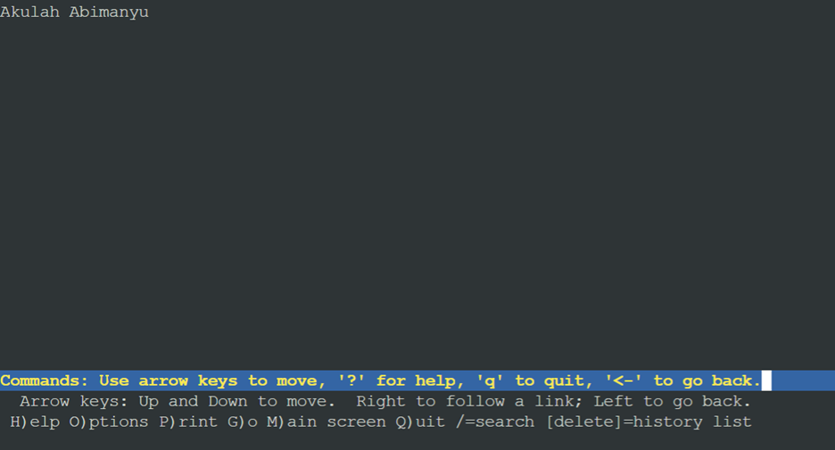
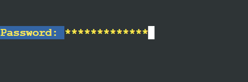
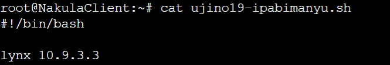

# Jarkom-Modul-2-B01-2023-

| Name           | NRP        | Kelas     |
| ---            | ---        | ----------|
| Rr. Diajeng Alfisyahrinnisa Anandha | 5025211147 | Jaringan Komputer (B) |

## Soal No 1

### Soal:
Yudhistira akan digunakan sebagai DNS Master, Werkudara sebagai DNS Slave, Arjuna merupakan Load Balancer yang terdiri dari beberapa Web Server yaitu Prabakusuma, Abimanyu, dan Wisanggeni. Buatlah topologi dengan pembagian sebagai berikut. Folder topologi dapat diakses pada drive berikut 

### Jawab:

- Kita buat dulu topologi nya di GNS3:
    <br></br>

- Lalu, kita lakukan network configuration di masing-masing node:  
    a. Node Router:  
        <br></br>
    b. Node YudhistiraDNSMaster:  
        <br></br>
    c. Node WerkudaraDNSSlave:  
        <br></br>
    d. Node NakulaClient:  
        <br></br>
    e. Node SadewaClient:  
        <br></br>
    f. Node ArjunaLoadBalancer:  
        <br></br>
    g. Node PrabukusumaWebServer:  
        <br></br>
    h. Node AbimanyuWebServer:  
        <br></br>
    i. Node WisanggeniWebServer:  
        <br></br>
- Setelah itu, di router, kita tetapkan
    ```iptables -t nat -A POSTROUTING -o eth0 -j MASQUERADE -s 10.9.0.0/16```   
    yang ditaruh dalam .bashrc  pada node `router`  
    
- Setelah itu, untuk semua node, kita tambahkan   
    `nameserver 192.168.122.1`  
    Tujuan: agar semua node dapat terhubung dengan internet, disini saya contohkan untuk node `PrabukusumaWebServer`   
      

### Kendala Pengerjaan:
Tidak ada

## Soal No 2

### Soal:
Buatlah website utama pada node arjuna dengan akses ke arjuna.yyy.com dengan alias www.arjuna.yyy.com dengan yyy merupakan kode kelompok.

### Jawab:

- Kita ingin membuat website utama yang mengarah ke node arjuna. Maka, kita pakai node `YudhistiraDNSMaster` yang menjadi DNS Master  
- Konfigurasi di YudhistiraDNSMaster:  
    a. Kita tetapkan syntax pada .bashrc di node YudhistiraDNSMaster:  
        <br></br>
    b. Kita lakukan konfigurasi domain `arjuna.b01.com`:  
        <br></br>
        > Disini, kita setup zone `arjuna.b01.com` dengan tipe master di `/etc/bind/named.conf.local`  
        > Lalu, kita setup di `/etc/bind/jarkom/arjuna.b01.com` untuk membuat domain baru. 
- Kita lakukan pengujian di Client dengan syntax:  
    <br></br>
- Hasil:
    <br></br>
    > Dari pengujian `host -t CNAME www.arjuna.b01.com`, kita ketahui bahwa www.arjuna.b01.com merupakan alias dari arjuna.b01.com
    > Lalu dari hasil ping, kita ketahui bahwa pengambilan data dilakukan oleh `IP: 10.9.1.4` yang merupakan IP dari node `ArjunaLoadBalancer`

### Kendala Pengerjaan:
Tidak ada

## Soal No 3

### Soal:
Dengan cara yang sama seperti soal nomor 2, buatlah website utama dengan akses ke abimanyu.yyy.com dan alias www.abimanyu.yyy.com.

### Jawab:
- Kita ingin membuat website utama dengan akses abimanyu.b01.com dan alias www.abimanyu.b01.com, sehingga kita melakukan konfigurasi di DNS Master yaitu di `YudhistiraDNSMaster`:  
    <br><br>
    > Dari kode diatas, kita buat zone untuk `abimanyu.b01.com` pada `/etc/bind/named.conf.local`
    > Kita juga tetapkan domain abimanyu.b01.com beserta aliasnya di `/etc/bind/jarkom/abimanyu.b01.com`
- Lalu, kita lakukan pengujian di client:  
    <br></br>
- Hasil dari pengujian:  
    <br></br>
    > Kita ketahui bahwa www.abimanyu.b01.com merupakan alias dari abimanyu.b01.com
    > Lalu, kita ketahui juga bahwa request dilakukan oleh `IP = 10.9.3.3` yang merupakan IP dari node `AbimanyuWebServer`

### Kendala Pengerjaan:
Tidak ada

## Soal No 4

### Soal:
Kemudian, karena terdapat beberapa web yang harus di-deploy, buatlah subdomain parikesit.abimanyu.yyy.com yang diatur DNS-nya di Yudhistira dan mengarah ke Abimanyu.

### Jawab:
- Karena kita ingin buat subdomain parikesit.abimanyu.b01.com dan diatur DNS-nya di Yudhistira, maka kita lakukan konfigurasi di node `YudhistiraDNSMaster` dan mengarah ke IP `AbimanyuWebServer`  
    <br></br>
    > Dari kode diatas, karena parikesit merupakan sebuah  subdomain yang mengarah ke IP AbimanyuWebServer, maka kita gunakan `A` 
- Lalu, kita lakukan pengujian di client:  
    <br></br>
- Hasil yang kita dapatkan:  
    <br></br>

### Kendala Pengerjaan:
Tidak ada

## Soal No 5

### Soal:
Buat juga reverse domain untuk domain utama. (Abimanyu saja yang direverse)

### Jawab:
- Kita gunakan node `Yudhistira` untuk membuat reverse domain dengan IP menuju abimanyu:  
    <br></br>
- Kita lakukan pengujian di client:  
    <br></br>
- Hasil yang kita dapatkan:  
    <br></br>

### Kendala Pengerjaan:
Tidak ada

## Soal No 6

### Soal:
Agar dapat tetap dihubungi ketika DNS Server Yudhistira bermasalah, buat juga Werkudara sebagai DNS Slave untuk domain utama.

### Jawab:
- Maka, di node `YudhistiraDNSMaster` kita tetapkan type dari `abimanyu.b01.com` adalah `master`:  
    <br></br>
    > Disini, kita terapkan  
        ```
            also-notify { 10.9.2.3; } // IP Werkudara
            allow-transfer { 10.9.2.3; } // IP Werkudara
        ```  
- Di node `WerkudaraDNSSlave`, kita tetapkan type dari `abimanyu.b01.com` adalah `slave`:  
    <br></br>
- Kita lakukan uji client:  
    <br></br>

### Kendala Pengerjaan:
Tidak ada

## Soal No 7

### Soal:
Seperti yang kita tahu karena banyak sekali informasi yang harus diterima, buatlah subdomain khusus untuk perang yaitu baratayuda.abimanyu.yyy.com dengan alias www.baratayuda.abimanyu.yyy.com yang didelegasikan dari Yudhistira ke Werkudara dengan IP menuju ke Abimanyu dalam folder Baratayuda.

### Jawab:
- Karena kita ingin subdomain dari domain `abimanyu.b01.com`, maka kita buat subdomain di node `YudhistiraDNSMaster` yang akan didelegasikan:
    <br></br>
    > Disini, kita tetapkan subdomain bernama `baratayuda` yang akan menuju IP AbimanyuWebServer
    > Lalu, kita ubah konfigurasi di `/etc/bind/named.conf.options` untuk menghapus bagian `dssec-validation` dan menambahkan syntax `allow-query` yang digunakan untuk query khusus domain
- Karena kita akan melakukan delegasi dari yudhistira ke werkudara, maka kita lakukan konfigurasi juga di node `WerkudaraDNSSlave`:  
    <br></br>
    > Lalu, kita ubah konfigurasi di `/etc/bind/named.conf.options` untuk menghapus bagian `dssec-validation` dan menambahkan syntax `allow-query` yang digunakan untuk query khusus domain
- Setelah itu, kita lakukan pengujian client:
    <br></br>
- Hasil dari pengujian:
    <br></br>

### Kendala Pengerjaan:
Tidak ada

## Soal No 8

### Soal:
Untuk informasi yang lebih spesifik mengenai Ranjapan Baratayuda, buatlah subdomain melalui Werkudara dengan akses rjp.baratayuda.abimanyu.yyy.com dengan alias www.rjp.baratayuda.abimanyu.yyy.com yang mengarah ke Abimanyu.

### Jawab:
- Karena kita disuruh buat subdomain melalui werkudara, maka kita melakukan konfigurasi di node `WerkudaraDNSSlave`:  
    <br></br>
    > Disini, kita buat subdomain baru bernama `rjp.baratayuda.abimanyu.b01.com` 
    > Kita juga buat alias bernama `www.rjp.baratayuda.abimanyu.b01.com`
- Lalu, kita lakukan pengujian di client:
    <br></br>
- Hasil pengujian: 
    <br></br>

### Kendala Pengerjaan:
Tidak ada

## Soal No 9-10

### Soal:
Arjuna merupakan suatu Load Balancer Nginx dengan tiga worker (yang juga menggunakan nginx sebagai webserver) yaitu Prabakusuma, Abimanyu, dan Wisanggeni. Lakukan deployment pada masing-masing worker.

Kemudian gunakan algoritma Round Robin untuk Load Balancer pada Arjuna. Gunakan server_name pada soal nomor 1. Untuk melakukan pengecekan akses alamat web tersebut kemudian pastikan worker yang digunakan untuk menangani permintaan akan berganti ganti secara acak. Untuk webserver di masing-masing worker wajib berjalan di port 8001-8003. Contoh:  
    - Prabakusuma:8001  
    - Abimanyu:8002  
    - Wisanggeni:8003  

### Jawab:

- Untuk memainkan loadbalancing, kita pertama-tama setup konfigurasi di DNS Master terlebih dahulu yaitu di node `YudhistiraDNSMaster`
    <br></br>
- Lalu, kita setup nginx di `ArjunaLoadBalancer`:
    <br></br>
    > Karena menggunakan konsep Round Robin, maka kita buat urutan. Bahwa jika port 8001 mati, maka web akan up ke port 8002. Jika port 8001 dan 8002 mati, maka web akan up ke port 8003
- Kita setup di node `PrabukusumaWebServer` yang menjadi worker: 
    <br></br>
    > Karena untuk `PrabukusumaWebServer` kita mengarah ke port 8001, maka kita ubah di `/etc/nginx/sites-available/arjuna.b01.com` untuk listen ke port 8001
- Kita setup di node `AbimanyuWebServer` yang menjadi worker:
    <br></br>
    > Karena untuk `AbimanyuWebServer` kita mengarah ke port 8002, maka kita ubah di `/etc/nginx/sites-available/arjuna.b01.com` untuk listen ke port 8002
- Kita setup di node `WisanggeniWebServer` yang menjadi worker:
    <br></br>
    > Karena untuk `WisanggeniWebServer` kita mengarah ke port 8002, maka kita ubah di `/etc/nginx/sites-available/arjuna.b01.com` untuk listen ke port 8003
- Lalu, kita lakukan pengujian client: 
    <br></br>
- Hasil uji ketika nginx di semua node masih menyala:
    <br></br>
- Hasil uji ketika nginx di node `PrabukusumaWebServer` dimatikan:
    <br></br>
- Hasil uji ketika nginx di node `AbimanyuWebServer` dimatikan:
    <br></br>

### Kendala Pengerjaan:
Tidak ada

## Soal No 11

### Soal:
Selain menggunakan Nginx, lakukan konfigurasi Apache Web Server pada worker Abimanyu dengan web server www.abimanyu.yyy.com. Pertama dibutuhkan web server dengan DocumentRoot pada /var/www/abimanyu.yyy

### Jawab:
- Karena kita ingin up ke webserver Apache pada abimanyu, maka kita lakukan setup di node `AbimanyuWebServer`:
    <br></br>
    > Disini, kita stop dulu nginx nya agar apache2 dapat bekerja
    > Lalu, kita lakukan git clone untuk mengambil assets untuk `AbimanyuWebServer`
- Kita lakukan pengujian client:
    <br></br>
- Hasil pengujian:
    <br></br>

### Kendala Pengerjaan:
Tidak ada

## Soal No 12

### Soal:
Setelah itu ubahlah agar url www.abimanyu.yyy.com/index.php/home menjadi www.abimanyu.yyy.com/home.

### Jawab:
- Pada node `AbimanyuWebServer`, kita lakukan rewrite agar dari `www.abimanyu.yyy.com/index.php/home` dapat menjadi `www.abimanyu.yyy.com/home`
    <br></br>
    > Disini, kita buat file .htaccess agar dapat dijalankan oleh virtual host
    > Isi dari .htaccess:  
        a. RewriteEngine On:  
            Ini adalah perintah yang mengaktifkan mod_rewrite di server web Apache.  
            <br></br> 
        b. RewriteRule ^home$ index.php/home [NC, L]:  
            RewriteRule: Ini adalah perintah untuk menentukan aturan pemetaan ulang URL. 
            <br></br>  
        ^home$: ini mencocokkan URL yang hanya berisi kata "home". Pola tersebut merupakan ekspresi reguler yang mencocokkan kata "home" di URL.  
            <br></br> 
          index.php/home: Ini adalah bagian target atau hasil pemetaan ulang. Ini akan menggantikan URL yang cocok dengan "home". Dalam hal ini, itu mengarahkan permintaan ke "index.php/home".
          <br></br> 
        [NC] berarti aturan ini bersifat case-insensitive, artinya "home" dan "Home" akan cocok.
        <br></br> 
        [L] menunjukkan bahwa ini adalah aturan terakhir yang akan diterapkan jika ada kecocokan. Artinya, jika URL cocok dengan pola, maka pemetaan ulang akan diterapkan, dan tidak akan ada aturan pemetaan ulang tambahan yang diterapkan setelahnya.

- Lalu, kita lakukan pengujian client:  
    <br></br>
- Hasil uji:
    <br></br>

### Kendala Pengerjaan:
Tidak ada

## Soal No 13

### Soal:
Selain itu, pada subdomain www.parikesit.abimanyu.yyy.com, DocumentRoot disimpan pada /var/www/parikesit.abimanyu.yyy

### Jawab:
- karena kita ingin membuat subdomain `www.parikesit.abimanyu.b01.com`, maka kita lakukan konfigurasi di node `AbimanyuWebServer`:  
    <br></br>
- Setelah membuat subdomain di `AbimanyuWebServer`, kita juga lakukan konfigurasi di DNS Master yaitu di `YudhistiraDNSMaster` karena domain `abimanyu.b01.com` di set up di Yudhistira:  
    <br></br>
- Lalu, kita lakukan pengujian client:
    <br></br>
- Hasil pengujian:
    <br></br>

### Kendala Pengerjaan:
Tidak ada

## Soal No 14

### Soal:
Pada subdomain tersebut folder /public hanya dapat melakukan directory listing sedangkan pada folder /secret tidak dapat diakses (403 Forbidden).

### Jawab:
- Di `AbimanyuWebServer`, kita lakukan konfigurasi untuk menerapkan listing dan mematikan listing:
    <br></br>
    > Disini, untuk menerapkan listing maka menggunakan  
     `Options + Indexes`  
    > Untuk menonaktfikan listing, maka menggunakan  
    `Options -Indexes`
- Lalu, kita lakukan pengujian client:
    <br></br>
- Hasil pengujian untuk /public:
    <br></br>
- Hasil pengujian untuk /secret:
    <br></br>

### Kendala Pengerjaan:
Tidak ada

## Soal No 15

### Soal:
Buatlah kustomisasi halaman error pada folder /error untuk mengganti error kode pada Apache. Error kode yang perlu diganti adalah 404 Not Found dan 403 Forbidden.

### Jawab:
- Untuk melakukan kostumisasi khusus untuk folder /error, maka kita lakukan setup di `AbimanyuWebServer`: 
    <br></br>
    > Disini, kita terapkan  
    `ErrorDocument 403 /error/403.html`  
    yang berarti untuk eror 403 akan muncul tampilan sesuai di /error/403.html
    > Disini, kita terapkan  
    `ErrorDocument 404 /error/404.html`  
    yang berarti untuk eror 404 akan muncul tampilan sesuai di /error/404.html
- Lalu kita lakukan pengujian client:
    <br></br>
- Hasil pengujian untuk 403:
    <br></br>
- Hasil pengujian untuk 404:
    <br></br>

### Kendala Pengerjaan:
Saat diuji dengan kode yang sama itu blank page. Ternyata, saya ga scroll ke atas.. pas scroll ke atas, baru muncul tulisan.

## Soal No 16

### Soal:
Buatlah suatu konfigurasi virtual host agar file asset www.parikesit.abimanyu.yyy.com/public/js menjadi 
www.parikesit.abimanyu.yyy.com/js 

### Jawab:
- karena kita ingin mengubah /public/js menjadi /js, maka kita terapkan prinsip rewrite di `AbimanyuWebServer`
    <br></br>
    > Karena kita ingin menggunakan alias, maka menggunakan syntax:  
    `Alias "/js" "/var/www/parikesit.abimanyu.b01.com/public/js"`
- Lalu kita lakukan pengujian client:
    <br></br>
- Hasil pengujian:
    <br></br>

### Kendala Pengerjaan:
Tidak ada

## Soal No 17

### Soal:
Agar aman, buatlah konfigurasi agar www.rjp.baratayuda.abimanyu.yyy.com hanya dapat diakses melalui port 14000 dan 14400.

### Jawab:
- Untuk mengubah port, maka kita lakukan pengubahan di node `AbimanyuWebServer`:
    <br></br>
    <br></br>
    > Disini, kita ubah listen port menjadi 14000 dan 14400
- Lalu, kita lakukan pengujian client:
    <br></br>
- Hasil pengujian:
    <br></br>
    <br></br>
    <br></br>

### Kendala Pengerjaan:
Tidak ada

## Soal No 18

### Soal:
Untuk mengaksesnya buatlah autentikasi username berupa “Wayang” dan password “baratayudayyy” dengan yyy merupakan kode kelompok. Letakkan DocumentRoot pada /var/www/rjp.baratayuda.abimanyu.yyy.

### Jawab:
- Kita terapkan authentikasi di node `AbimanyuWebServer`:
    <br></br>  
    > Disini kita terapkan aturan autentikasi bahwa hanya pengguna dengan nama wayang yang dapat masuk ke area yang diproteksi, lalu hanya user root yang dapat memiliki akses ke berkas password atau .htpasswd. Lalu, user lain dapat membaca berkas tersebut. Selain itu, untuk membaca autentikasi, kita butuh www-data:www-data agar apache2 dapat melakukan autentikasi  
    <br></br>
    <br></br>
    <br></br>
- Kita lakukan pengujian
    <br></br>
- Hasil pengujian:
    <br></br>
    <br></br>
    <br></br>

### Kendala Pengerjaan:
Tidak ada

## Soal No 19

### Soal:
Buatlah agar setiap kali mengakses IP dari Abimanyu akan secara otomatis dialihkan ke www.abimanyu.yyy.com (alias)

### Jawab:
- Untuk secara mutlak apabila akses IP dari abimanyu ke `www.abimanyu.b01.com`, maka dapat dilakukan:
    <br></br>
    > Disini, kita menggunakan syntax:  
    `Redirect Permanent / http://www.abimanyu.b01.com`
- Kita lakukan pengujian client:
    <br></br>
- Hasil uji:
    <br></br>

### Kendala Pengerjaan:
Tidak ada

## Soal No 20

### Soal:
Karena website www.parikesit.abimanyu.yyy.com semakin banyak pengunjung dan banyak gambar gambar random, maka ubahlah request gambar yang memiliki substring “abimanyu” akan diarahkan menuju abimanyu.png.

### Jawab:
- Karena kita ingin semua url yang mengandung kata "abimanyu" akan menuju "abimanyu.png", maka kita lakukan konfigurasi di `AbimanyuWebServer`:
    <br></br>
    <br></br>
    > Terdapat `RewriteEngine On` yang berarti perintah yang mengaktifkan mod_rewrite di server web Apache
    <br></br>
    > 'RewriteCond %{Request_uri} ^.*abimanyu.*' yang berarti jika permintaan URI (Request URI) mengandung string "abimanyu"
    <br></br>
    > `RewriteCond %{Request_uri} !/public/images/abimanyu.png` yang berarti Ini mengecualikan URI yang cocok dengan "/public/images/abimanyu.png". Artinya, jika URI mengarah ke berkas "/public/images/abimanyu.png", maka aturan pemetaan ulang tidak akan diterapkan.
    <br></br>
    > RewriteRule .* http://parikesit.abimanyu.b01.com/public/images/abimanyu.png [L, R=31] yang berarti:
    <br></br>
    a. .* mencocokkan semua karakter dalam URI
    <br></br>
    b. [L] menandakan bahwa ini adalah aturan terakhir yang akan diterapkan jika ada kecocokan
    <br></br>
    c. [R=31] menandakan bahwa server akan memberikan respons redirect (kode status HTTP 301) ke URL yang dituju. Kode status 301 menunjukkan bahwa alamat permanen diubah, dan browser akan mengikuti alamat yang baru
    <br></br>
- Kita lakukan pengujian:
    <br></br>
- Hasil pengujian:
    <br></br>
    a. yang menuju /abimanyu-student.jpg
    <br></br>
    b. yang menuju /lalaabimanyu.png
    <br></br>
    c. yang menuju /abimanyu.png
    <br></br>
    d. yang menuju /buddies.jpg
    <br></br>

### Kendala Pengerjaan:
Saat praktikum, belum sepenuhnya mengarah ke abimanyu.png. Waktu revisi, semua unsur "abimanyu" telah mengarah ke abimanyu.png
